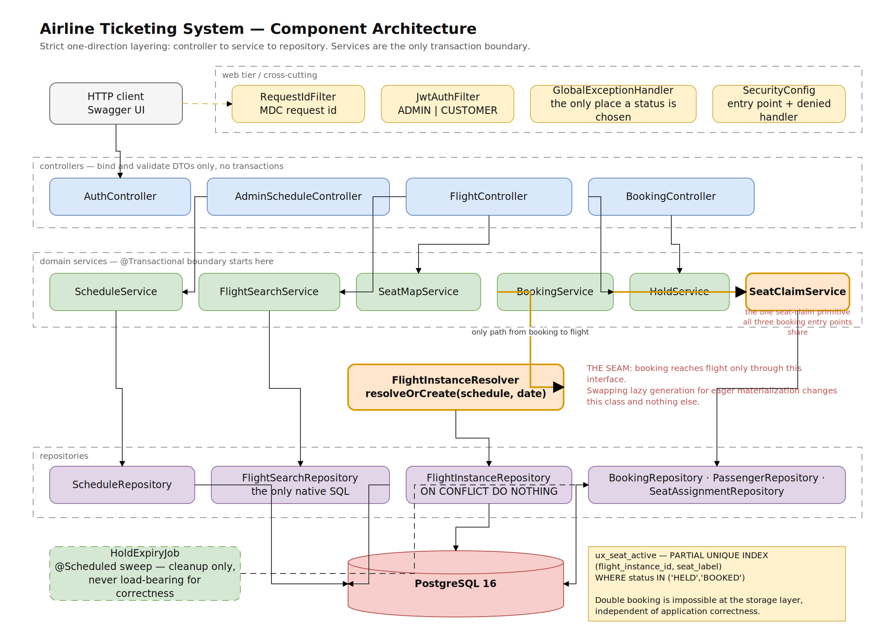
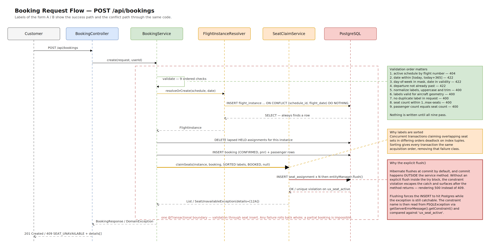
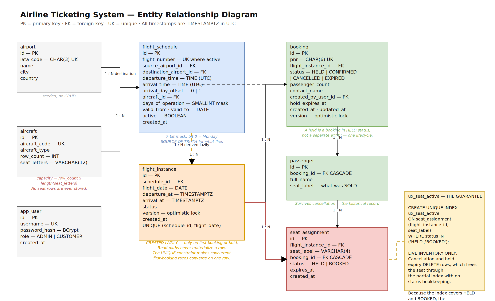
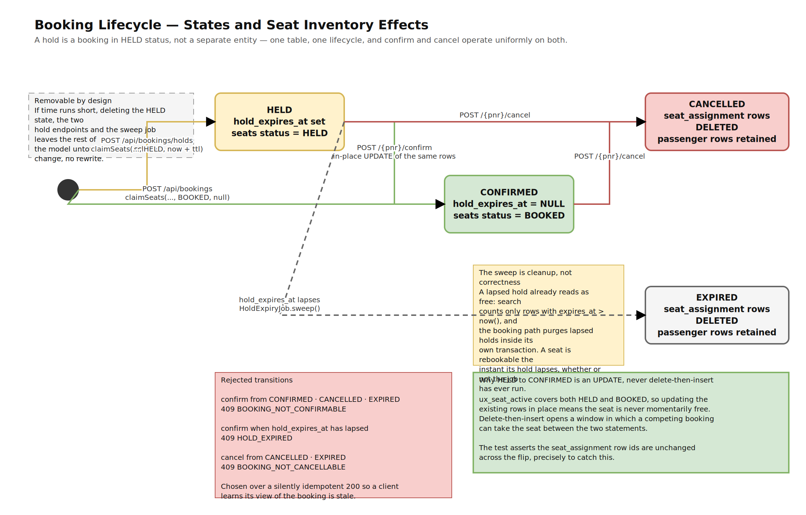
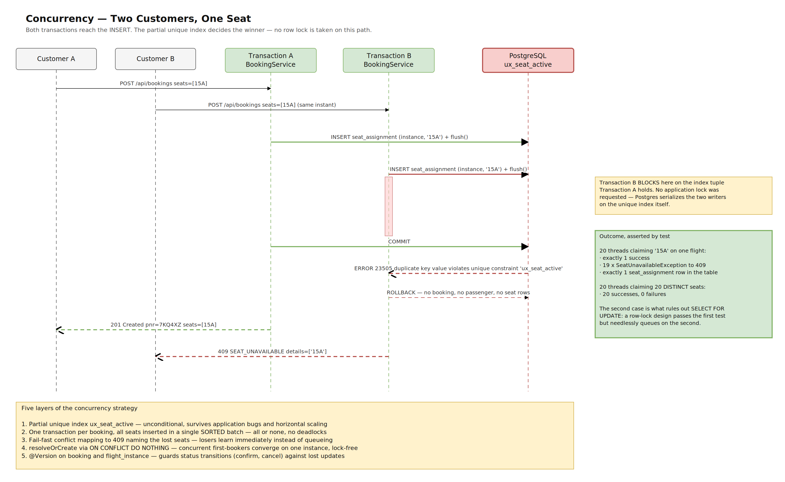

# High-Level Design — Airline Reservation System

**Scope:** backend for a single airline. Schedule management, flight search, seat
inventory, booking, holds and cancellation.

---

## 1. Overall architecture

A single Spring Boot service over PostgreSQL, layered strictly in one direction:

```
HTTP → RequestIdFilter → JwtAuthFilter → Controller (@Valid DTO)
     → Service (@Transactional, domain rules)
     → Repository (JPA / native SQL) → PostgreSQL
     ← Mapper → Response DTO → HTTP
Errors ─→ GlobalExceptionHandler → ApiError
```

- **Controllers** bind and validate DTOs. No business logic, no transactions.
- **Services** own domain rules and are the sole transaction boundary.
- **Repositories** are Spring Data JPA interfaces, plus one native query.

Entities never cross the controller boundary; mapping is explicit.



### Why a single service

The brief describes one airline with one database and one transactional
invariant that matters: a seat belongs to at most one booking. That invariant is
enforced by a database constraint, and splitting the system across services would
either move it into application code or require distributed transactions. Neither
trade is worth making at this scale. The module boundaries below are drawn so the
system could be split later without redesigning the data model.

---

## 2. Components

| Package | Responsibility |
|---|---|
| `config` | `Clock` bean, externalized booking policy, OpenAPI, scheduling |
| `common` | Error contract (`ErrorCode`, `DomainException`, `ApiError`, handler), request-id filter, PNR generator |
| `security` | JWT minting and verification, roles, login |
| `airport`, `aircraft` | Seeded reference data; seat-label generation and normalization |
| `schedule` | `FlightSchedule`, the day-of-operation bitmask, admin APIs |
| `flight` | Instance derivation, search, seat map |
| `booking` | Seat claim, booking lifecycle, holds, expiry sweep |

### The one seam that matters

`booking` reaches `flight` through exactly one interface:

```java
FlightInstance resolveOrCreate(FlightSchedule schedule, LocalDate date);
```

If flight-instance generation ever changes from lazy to eager, that class changes
and nothing in `booking` does. Every other cross-module call is a read of
reference data.

---

## 3. Service interactions and request flow

### Search
`FlightController` → `FlightSearchService` → `AirportService` (resolve IATA) →
`BookingWindowValidator` (422 if outside the window) → `FlightSearchRepository`
(one native query) → DTO mapping. Read-only transaction. **No writes of any kind.**

### Booking
`BookingController` → `BookingService.create` → `BookingRequestValidator` (nine
ordered checks) → `FlightInstanceResolver.resolveOrCreate` → purge lapsed holds →
insert booking and passengers → `SeatClaimService.claimSeats` → commit.
One read-write transaction end to end.



### Cancellation
Load by PNR → reject if not cancellable (409) → read the seat labels → set
`CANCELLED` → delete the `seat_assignment` rows. Seats are available the moment the
transaction commits.

---

## 4. Flight generation strategy

**Decision: schedules are the only source of truth. Instances are derived on read
and materialized lazily on first write.**

Search computes bookable flights in-query by matching route, validity window and the
day-of-week bit. A `flight_instance` row is created only when a booking or hold needs
something to attach seats to, guarded by `UNIQUE (schedule_id, flight_date)` so
concurrent first-bookers converge on one row.

| | Lazy hybrid (chosen) | Eager materialization | Instances + seat rows |
|---|---|---|---|
| Rows at rest | bookings only | ~100k instances | ~18M seat rows |
| Background job | hold expiry only | generation + rolling window | same, heavier |
| Search complexity | moderate (bitmask) | trivial | trivial |
| Schedule added mid-year | works immediately | needs backfill | needs backfill |
| Operational failure mode | none | job misses → flights vanish | same |

**What would flip this decision:** multiple airlines, or search needing per-instance
attributes that only a materialized row can carry — price, gate, delay status,
equipment swap. At that point the cost of backfill is worth paying, and only
`FlightInstanceResolver` changes.

**Invariant: read paths never materialize an instance.** Without it, search traffic
would silently convert the lazy strategy into eager materialization. Two tests
enforce it, one on search and one on the seat map.

---

## 5. Data model



Three decisions worth stating:

**No seat rows are stored.** A seat exists because the aircraft configuration
(`row_count` × `seat_letters`) says so. Only occupancy is persisted. For 300
schedules over a year this is the difference between zero rows and roughly 18
million.

**`seat_assignment` is live inventory only.** Cancellation and hold expiry *delete*
rows, which frees the seat through the partial index with no status bookkeeping.
History is not lost: `booking` keeps its `CANCELLED` status and `passenger` keeps the
`seat_label` that was sold. The duplicated label across the two tables is deliberate —
one records what was sold, the other what is currently occupied.

**A hold is a `booking` in `HELD` status, not a separate entity.** One lifecycle, so
confirm and cancel operate uniformly on both.



---

## 6. Concurrency strategy

The requirement: two customers must never hold the same seat, under any interleaving.



Five layers, strongest first:

1. **Partial unique index** `ux_seat_active (flight_instance_id, seat_label) WHERE
   status IN ('HELD','BOOKED')`. An absolute database-level guarantee that survives
   application bugs, concurrent requests, and multi-instance deployment.
2. **One transaction per booking, all seats inserted in a single sorted batch.** All
   requested seats succeed or none do. Sorting gives every transaction the same lock
   acquisition order, removing the deadlock case between overlapping seat sets.
3. **Fail-fast conflict mapping.** A constraint violation becomes `409
   SEAT_UNAVAILABLE` naming the lost seats. Losers do not queue.
4. **`resolveOrCreate` via `ON CONFLICT DO NOTHING`**, so concurrent first-bookers
   converge on one instance without a lock.
5. **`@Version` on `booking` and `flight_instance`** for status transitions, which
   prevents lost updates on concurrent confirm or cancel.

### Why no `SELECT ... FOR UPDATE` on the happy path

A row lock on `flight_instance` would serialize every booking on a popular flight,
and it is a *weaker* guarantee than the index: it holds only while every writer
remembers to take it, whereas the index holds unconditionally.

This is testable rather than assertable. `twentyThreadsSameSeatExactlyOneSucceeds`
proves safety — a row-lock design also passes it. `concurrentDistinctSeatsAllSucceed`
proves the design does not over-lock: twenty threads booking twenty *different* seats
all succeed, where a row-lock design would queue them behind one lock. Having both
tests is what makes "stronger and cheaper" a claim backed by evidence.

**When the pessimistic variant would be right:** a future requirement that must
read-then-decide across multiple seats atomically — auto-assigning the best available
block, say — where a conflict is expensive to retry rather than cheap.

### Evidence

`ConcurrentBookingTest`, four tests, run ten consecutive times with zero failures.
`tests/concurrency-smoke.sh` reproduces it over HTTP: 1 × 201, 19 × 409, 0 other.

---

## 7. Transaction boundaries

| Operation | Boundary |
|---|---|
| Search, seat map, booking lookup | one `readOnly` transaction |
| Create booking / hold | one read-write transaction, validation through seat insert |
| Confirm | one read-write transaction |
| Cancel | one read-write transaction |
| Hold expiry sweep | one read-write transaction per batch |

No transaction spans an HTTP boundary, so no open transaction ever waits on a client.

---

## 8. Assumptions

From the brief: single airline; a seat belongs to at most one booking; a booking
covers one flight instance; seat maps are fixed per aircraft; schedules do not change
after creation; airports and aircraft are preloaded; the booking window is 365 days;
all timestamps are UTC and time-zone conversion is out of scope.

Added by this design:

1. Aircraft seating is a uniform grid — no blocked seats, no cabin classes.
2. At most one **active** schedule per flight number, enforced by a partial unique index.
3. Schedule times are UTC times-of-day; `arrival_day_offset` handles overnight flights.
4. Maximum 9 seats per booking.
5. Passenger data is a name only.
6. A cancelled booking is retained; its inventory rows are deleted.
7. Authentication is illustrative: seeded users, HS256 JWT, BCrypt hashes.
8. **A flight that has already departed today cannot be booked**, even though the
   365-day window permits the date. The brief does not require this; it is a decision.
9. **Seat labels are normalized to uppercase before any comparison.** This is a
   correctness requirement, not cosmetic: the unique index protects only
   identically-spelled labels, so without it `12A` and `12a` would be two rows and the
   same physical seat could be sold twice.

---

## 9. Known limitations

1. The hold-expiry job runs on every instance in a multi-instance deployment. The fix
   is ShedLock or a PostgreSQL advisory lock; out of scope. Correctness does not depend
   on the job.
2. Search reads the schedule table on every request with no caching. Schedules are
   immutable, so a short-TTL cache is the obvious next step; unnecessary at this scale.
3. Under extreme contention for one seat, losing clients retry at the application
   layer; there is no queue or waitlist.
4. Seat maps assume a uniform grid. Real aircraft have missing seats at exits.
5. No multi-leg itineraries, so no cross-flight transactional booking.
6. A booking is readable and cancellable by anyone holding its PNR. Scoping to the
   authenticated user is a small change, deliberately out of scope for the brief.
7. JWTs cannot be revoked before expiry, which is the cost of statelessness.
8. `db/schema.sql` is generated and must be regenerated when migrations change.
